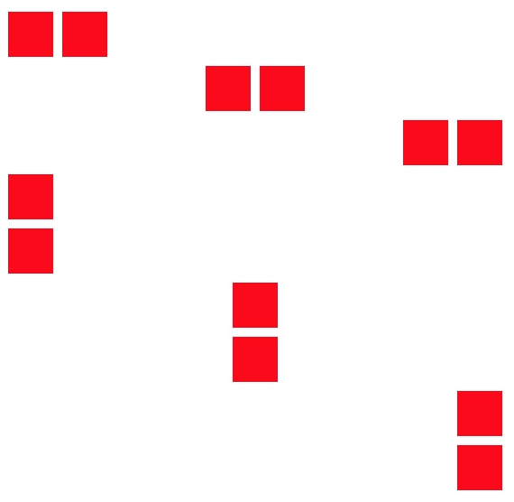

FLOU
===============================================================================

Webの開発をやったことのある方なら誰しも、「CSSって結局どう書くのがベストなの？」という悩みを感じたことがあるでしょう。
一見簡単なCSSですが、一度書き始めるとそのあまりの自由さに、まるで大海原に放り出された赤子のような気分になってしまいますよね。
人生何事も、ある程度制約があったほうがやりやすいものです。
そんなわけで今日はCSSの設計について考えてみましょう。

[FLOCSSを扱いきれないあなたに贈る、スリムなCSS設計の話 - 鴇田将克](https://webnaut.jp/technology/20170407-2421/)より抜粋・改変

F、L、O、Uの4つに分けよう
-------------------------------------------------------------------------------
基本のアーキテクチャとしては、Foundation、Layout、Object、Utilityの4つに分けましょう。

例えばこんな組み方にしたいとき、


それぞれの役割は、図にするとこのようになります。<br>
（分かりやすくするために一部簡略化しています。）


F、L、O、U、の4つが、Webページに必要な要素を過不足なく担当できているのがわかると思います。<br>
具体的なコーディングルールは、下記のような感じです。

### Foundation

* リセットCSS、NormarizeCSSなどの、すべてのベースとなるCSS
* 基本的にコードは追加しない
* foundation.scssに記述

<figcaption>foundation.scss</figcaption>

```css
html, body, h1, h2, h3, h4, ul, ol, dl, li, dt, dd, p, div, span, img, a, table, tr, th, td {
  margin: 0;
  padding: 0;
  border: 0;
  letter-spacing: 0.5px;
  font-weight: normal;
  font-size: 100%;
  font-family: "Helvetica Neue",
               Arial,
               "Hiragino Kaku Gothic ProN",
               "Hiragino Sans",
               Meiryo,
               sans-serif;
  vertical-align:baseline;
  box-sizing: border-box;
  line-height: 1.8;
  word-wrap: break-word;
}
```

### Layout

* パーツの配置や、ラッパーとしての幅や高さなどを決定するクラス
* layout.scssに記述

<figcaption>layout.scss</figcaption>

```css
.justify-left {
  display: grid;
  justify-content: flex-start;
}
.justify-right {
  display: grid;
  justify-content: flex-end;
}
.justify-center {
  display: grid;
  justify-content: center;
}
```

### Object

* ページをまたいで使われる各種パーツを定義するクラス
* そのパーツ内で常に同様の振る舞いをするものに関してのみスタイルを定義
* object.scssに記述

<figcaption>object.scss</figcaption>

```css
.boxA {
    width: 100px;
    height: 100px;
    color: red;
}
.boxB {
    width: 200px;
    height: 200px;
    color: green;
}
```

### Utility

* 調整用のクラス
* margin、padding、font-size、colorなどを付与するのに使用
* 他種類のパーツ間の空き調整や、パーツとして認められないような、自由な振る舞いをする要素に対してはこちらのクラスを使用
* utility.scssに記述

<figcaption>utility.scss</figcaption>

``` css
.mt10 { margint-top: 10px; }
.mt20 { margint-top: 20px; }
.mt30 { margint-top: 30px; }
```

この設計を、F、L、O、Uの頭文字をとって、ここでは便宜的にFLOUと呼ぶことにします。


FLOU設計のメリットは？
-------------------------------------------------------------------------------
さて、このFLOUの設計を使うとどんなハッピーなことがあるのでしょうか。

### レイアウトが劇的に楽
まず言えるのが、「モジュールの配置に関していちいちCSSを考える必要がなくなる」ということです。
Layoutに適切なクラスを用意しておくことによって、モジュール（Object）たちを柔軟に、かつスピーディーに配置していくことが可能になります。
例えば、css gridを使ったLayoutクラスを使えば、次のように柔軟にモジュールを配置できます。



<figcaption>index.html</figcaption>

``` html
<div class="justify-left">
  <div class="box"></div>
  <div class="box"></div>
</div>

<div class="justify-center">
  <div class="box"></div>
  <div class="box"></div>
</div>

<div class="justify-right">
  <div class="box"></div>
  <div class="box"></div>
</div>

<div class="justify-left direction-row">
  <div class="box"></div>
  <div class="box"></div>
</div>

<div class="justify-center direction-row">
  <div class="box"></div>
  <div class="box"></div>
</div>

<div class="justify-right direction-row">
  <div class="box"></div>
  <div class="box"></div>
</div>
```

<figcaption>layout.scss</figcaption>

``` css
.justify-left {
  display: grid;
  grid-auto-flow: column;
  justify-content: start;
}
.justify-center {
    display: grid;
    grid-auto-flow: column;
    justify-content: center;
}
.justify-right {
    display: grid;
    grid-auto-flow: column;
    justify-content: end;
}
.direction-row {
    display: grid;
    grid-auto-flow: row;
}
.box {
  display: inline;
  width: 50px;
  height: 50px;
  margin: 5px;
  background-color: red;
}
```

ここで使っている ```.justify-left``` などのクラスは、子要素に依存しないレイアウトのクラスとなるので、どんなモジュールに対しても使い回すことができます。
（依存を完全に0にしているわけではありませんが。）

また、配置のためのクラス以外にも、

<figcaption>layout.scss</figcaption>

``` css
.w25  { width:   25%; }
.w50  { width:   50%; }
.w100 { width:  100%; }
.h25  { height:  25%; }
.h50  { height:  50%; }
.h100 { height: 100%; }
```

のように、ラッパーの幅や高さを指定したりするLayoutクラスを用意しておくのも強力です。
このように、レイアウトに関する記述をLayoutクラスとして切り出し、使い回すことで、Object内で定義するモジュールを柔軟に配置することができるようになります。

### CSSの見通しが良くなる
FLOUを使う二つ目の利点として、「ファイル全体の見通しが良くなる」というものがあります。
例えば、

<figcaption>object.scss</figcaption>

``` css
.boxA {
    width: 100px;
    height: 100px;
    color: #ff0000;
    margin-top: 20px; /* ←これに注目 */
}
.boxB {
    width: 200px;
    height: 200px;
    color: #00ff00;
    margin-top: 20px; /* ←これに注目 */
}
.textA {
    color: #ff0000;
    font-weight: bold;
    margin-top: 20px; /* ←これに注目 */
}
```

とするよりは、

<figcaption>utility.scss</figcaption>

```css
.mt20 {
  margin-top: 20px; /* ←これに注目 */
}
```

<figcaption>object.scss</figcaption>

```css
.boxA {
    width: 100px;
    height: 100px;
    color: #ff0000;
}
.boxB {
    width: 200px;
    height: 200px;
    color: #00ff00;
}
.textA {
    color: #ff0000;
    font-weight: bold;
}
```
として、各モジュールにhtml上で

```html
<div class="boxA mt20">
  boxA
</div>
```

のように ```.mt20``` を付与する方が、全体の見通しが良くなります。

ここでは、単に<br>
** それぞれのモジュールに対する記述が減ったので見やすくなった **<br>
ということに加えて<br>
** それぞれのモジュールにとって本質的でない記述が減った **<br>
ということも重要です。<br>

　上の例で記述されていた ```margin-top: 20px;``` は他のモジュールとの関係を定義するのに必要なだけであって、それぞれのモジュールには直接的には関係がない記述です。
このように、モジュール自体が他のモジュールとの関係に関するプロパティを持っていると、想定してなかったモジュールの組み合わせによって、「上の空きが大きすぎる」や「横並びになってくれない」などの不具合が生じかねません。<br>
　一方、FLOUの設計であれば、モジュール（Object）と配置（Layout）、調整（Utility）を分けたことで、<br>
** モジュールのデザイン修正をしたい場合はObjectクラスをいじって、**<br>
** 配置に関してはLayoutクラスの変更で対応し、** <br>
** モジュール間の空きをなど調整したい場合はUtilityクラスを変更すればよい** <br>
ということになるので、仕様の変更に強くなります。<br>
　オブジェクトの修正でない、例えばレイアウトの変更や、数px単位の微妙な空き調整なんかは、結局html上でのクラスの付け替え作業になるので、他のページへの影響をケアする必要がなくなるというのも嬉しいところです。

FLOUで書くときのポイントは？
-------------------------------------------------------------------------------
FLOUでは、どの粒度でモジュールを切り出していくのかがポイントになってきます。
理想的な切り出し方は、

* できるだけ小さい単位で切り出す
* しかし、常にセットで使うものに関しては一つのモジュールにまとめる

というところです。

　例えば、こんな部品を作るとします。


　この場合は、フォームとボタンとで一塊のモジュールとして切り出すのではなく、それぞれ別々の部品として切り出す方が良いでしょう。<br>


　なぜなら、もし「やっぱりこのページだけはフォームとボタンを縦並びに変更したい」となったときに、セットで切り出していた場合は、<br>
** 従来の「フォームとボタンが横並びのモジュール」に加えて、 **  <br>
** 新規の「フォームとボタンを縦並びのモジュール」をCSSファイルに追加する ** <br>
ということになりますが、別々で切り出していれば、<br>
** html上で、子要素を横並びにするLayoutクラスから子要素を縦並びにするLayoutクラスに変更する ** <br>
という対応だけで済み、モジュールのパターン（今回で言う「フォーム」と「ボタン」）をCSS上で増やすことなくデザインが実現できるからです。<br>
　このように、モジュールはできるだけ小さい単位で管理し、配置に関してはLayoutクラスとUtilityクラスに任せることで、CSSの肥大化を抑えることができるのです。<br>
　とはいえ、もちろん「このパーツはどんな場面でも一緒に使う」と言い切れるものに関しては、一緒で管理するのが良いでしょう。

まとめ
-------------------------------------------------------------------------------
　CSSの設計に関しては、SMACSSやFLOCSSなどのオブジェクト指向の設計に従うことで、メンテナンス性に優れたコードを書くことができます。<br>
　しかし、どの粒度でオブジェクトを切り出すのか、またオブジェクト以外のクラスはどう扱うかなどはサイトの特性によってまちまちなので、「どんなサイトにでも使える万能な設計手法」というものは存在しません。<br>
　そんなときは、今回ご紹介したミニマムな設計である「FLOU」をベースに最適解を模索し、自己流の設計としてアレンジしてみてはいかがでしょうか！
