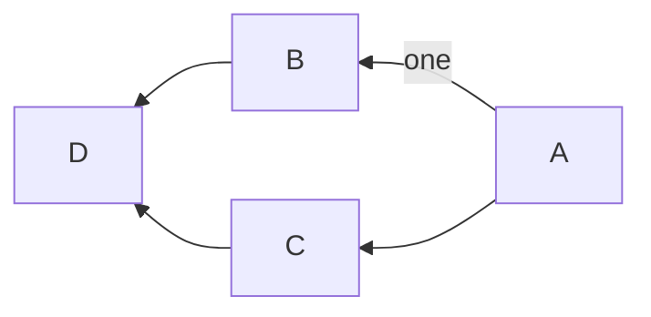

# Git(ギット)

## Gitとは?
分散型バージョン管理システム。
ソースコードの管理や、チームでの共同開発ができる。

### 利点
[はじめてのGit forデザイナー＆コーダー](https://www.slideshare.net/saekoyamamoto/gitfor)
  - Gitってなに？ プログラマではないけれど、Git導入するメリットは？ いわゆるデザイナーやコーダー向けの、「Gitとは？」「Gitの構造とは？」…のやさしい説明スライドです。

Gitを導入する利点がとてもよく分かる。5分くらいで気軽に読めるので、必読!!

### 概要
* Git を用いたバージョン管理のすすめ
https://www.jstage.jst.go.jp/article/isciesci/61/10/61_394/_pdf
  - 研究者向けに書かれたエッセイ。Gitのエッセンスを6ページに凝縮しており、概要を掴むのに最適。「3. Git によるバージョン管理」、「4. 複数人での Git」を読むと全貌が掴める。

### 基本的な流れ

1. ファイルやディレクトリの状態を記録するためのデータベースをつくる。これをリポジトリ（貯蔵所、倉庫、宝庫)といい、今までに開発してきた全ての歴史が保存されていく場所。
2. ワーキングディレクトリ
  - ローカルコンピュータ(手元のコンピュータ)で、開発中のディレクトリのこと。
3. ステージングエリア
  - どのファイルをリポジトリへ保存するのかを管理する領域。
  - (準備ができたものを、リポジトリに登録(公開)するイメージ)
4. ローカルリポジトリ
  - 手元のコンピュータのリポジトリ。今までの自分の開発した履歴が保存されている。
5. リモートリポジトリ
  - クラウド上にある共同開発用のリポジトリ。

1.は一番最初に一度行う。  
2.で今まで通り開発を行い、区切りのいいところまで開発したら、  
3.のステージングエリア(準備領域)にファイルを登録して、  
4.のローカルリポジトリにコミット(保存)する。  
そして、2.に戻って、開発を続ける。  
5.のリモートリポジトリに、自分の開発履歴(ローカルリポジトリ)を公開する操作をpush(押し上げる)という。皆で共用したいものができたときにすると良い。(一人で開発しているときには、自分用のバックアップ(控え)になる。)
逆に、リモートリポジトリを、ローカルリポジトリに落とす操作をfetch(取ってくる)という。

### 操作環境

CUI: ターミナルからコマンドを入力して行う方法。基本。
GUI: グラフィカルに図示される。いろいろなソフトがあるが、SourceTree がおすすめ。

## 参考

### 書籍
* わかばちゃんと学ぶGit
  - 漫画や可愛いイラストが豊富で、分かりやすい。

* よくわかる入門Git
  - 本書は、Gitの基本的な使い方から、チーム開発で使うための機能「ブランチ」、そして高度なGitコマンドまでを解説した入門書です。さらにGitのブランチモデルである「Git flow」と「GitHub-flow」の二つも紹介。チーム開発の基本スキルが身につきます!

### Web
* [はじめてのGit forデザイナー＆コーダー](https://www.slideshare.net/saekoyamamoto/gitfor)
  - Gitってなに？ プログラマではないけれど、Git導入するメリットは？ いわゆるデザイナーやコーダー向けの、「Gitとは？」「Gitの構造とは？」…のやさしい説明スライドです。Gitを導入する利点がとてもよく分かる。5分くらいで気軽に読めるので、必読!!

* [Git を用いたバージョン管理のすすめ](https://www.jstage.jst.go.jp/article/isciesci/61/10/61_394/_pdf)
  - 研究者向けに書かれたエッセイ。Gitのエッセンスを6ページに凝縮しており、概要を掴むのに最適。「3. Git によるバージョン管理」、「4. 複数人での Git」を読むと全貌が掴める。

* [git - 簡単ガイド 猫でもわかるGit 最初の一歩](http://rogerdudler.github.io/git-guide/index.ja.html)
  - 一ページに纏めたGitの導入ページ。簡潔に纏まっています。

* [GIT チートシート](https://github.github.com/training-kit/downloads/ja/github-git-cheat-sheet.pdf)
  - Git を使えるようになったら見ておきたい。良く使うコマンドを2ページに纏めてある。

* [計算機科学実験及演習3 ハードウェア「Gitの使い方」](http://www.lab3.kuis.kyoto-u.ac.jp/~takase/le3a/2020HW3-git.pdf)
  - 京都大学情報学科計算機科学コース で学ぶ学生向けのGitの100枚(A4版なら25枚)のスライド。Git / GitHubについて、概要や使用例を紹介している。

* [Pro Git](https://git-scm.com/book/ja/v2)
  - 500ページにわたりGitを詳細に解説。
  - 二章だけでも読むとよい。80ページで、Gitの主な使い方が学べるチュートリアル形式になっており、手を動かしながら、基本的な使い方を習得できる。


## 環境設定

### macOS用パッケージマネージャ Homebrew をインストールする。
```
$ /bin/bash -c "$(curl -fsSL
  https://raw.githubusercontent.com/Homebrew/install/master/install.sh)"
```

### 高機能ターミナルソフト iTerm2 をインストールする。
```
$ brew cask install iterm2
```

### Git をインストールする。
```
$ brew install git
```

## Gitの初期設定

### バージョン確認
``` bash
$ git version
```

### コミット操作に付加する名前を設定する
```bash
git config --global user.name  "Yamada Taro"
```

### コミット操作に付加するメールアドレスを設定する
``` bash
git config --global user.email "taro@example.com"
```

### コマンドラインの出力を色をつけ見やすくする。
``` bash
git config --global color.ui auto
```

### git commit で Atom を使うようにする。
```
$ git config --global core.editor "atom --wait"
```
## 基本操作

### リポジトリの作成
ローカルリポジトリを新規作成する。
``` bash
$ git init [project-name]
```

既存のリモートリポジトリをダウンロードする。
``` bash
$ git clone [url]
```

### 変更の作成

新規または変更のあるファイルを表示する
``` bash
$ git status
```



#### git add
ステージへの追加

```
$ git add <ファイル名>
$ git add <ディレクトリ名>
$ git add .
```

#### git commit
変更をコミットする

```bash
git commit
git commit -m "メッセージ"
```

## 状態の確認方法

#### git status
現在の変更状況をファイル単位で確認する

```bash
git status
```
・ワークツリーとステージ
・ステージとリポジトリ
上記のそれぞれで変更されたファイルが表示される。

#### git diff
現在の変更差分を確認する

```bash
# git add する前の変更分
git diff
git diff <ファイル名>

# git add した後の変更分
git diff --staged
```

#### git log
変更履歴を確認する

```bash
# １行で表示する
git log --oneline

# ファイルの変更差分を表示する
git log -p index.html

# 表示するコミット数を制限する
git log -n <コミット数>
```

##ファイルの移動・削除の記録方法

#### git rm
ファイルの削除を記録する

```bash
# ファイルごと削除
git rm <ファイル名>
git rm -r <ディレクトリ名>

# ファイルを残したい時
git rm --cached <ファイル名>
```
パスワードファイルなど間違えてコミットしてしまった場合には
`--cached` オプションを使ってgitの追跡から外す


#### git mv
ファイルの移動を記録する(ファイル名変更)

```bash
$ git mv <旧ファイル> <新ファイル>
```

## 変更を取り消す処理
#### git checkout
ファイルの変更を取り消す

```bash
git checkout -- <ファイル名>
git checkout -- <ディレクトリ名>

# 前変更を取り消す
git checkout -- .
```


#### git reset HEAD
ステージングを取り消す

```bash
git reset HEAD <ファイル名>
git reset HEAD <ディレクトリ名>

# 全変更を取り消す
git reset HEAD .
```
ステージングは取り消されるが、ファイルの変更は取り消されないので、ファイルの変更まで取り消したい場合は「git checkout」コマンドを使う。


## リモート

#### git add origin
リモートリポジトリを新規登録する

```bash
git add origin https:github.com/user/repo.git
```
* originというショートカットでURLのリモートリポジトリを登録する
* 今後は `origin` という名前でgithubリポジトリにアップしたり取得したりできる
* gitではメインのリモートリポジトリの事を `origin` と呼んでいる

#### git push
リモートリポジトリ（Github）へ送信する

```bash
git push <リモート名><ブランチ名>
git push origin master

# 次回以降 git push だけでよくなるコマンド
git push -u origin master
```


# 対応するURLを表示
git remote -v
```

#### git remote show
リモートの詳細情報を表示する

```bash
git remote show <リモート名>
git remote show origin
```
* FetchとPushのURL
* リモートブランチ
* git pullの挙動
* git pushの挙動

#### git remote rename
リモートを変更・削除する

```bash
# リモートを変更する場合
git remote rename <旧リモート名> <新リモート名>
git remote rename tutorial new_tutorial

# リモートを削除する場合
git remote rm <リモート名>
git remote rm new_tutorial
```

#### git remote add
リモートリポジトリを新規追加する

```bash
git remote add <リモート名> <リモートURL>
git remote add tutorial https://github.com/user/repo.git

# 「origin」で登録した時と同じように次回からは「tutorial」というショートカットでプッシュやプルをする事ができる。
```

##### リモートリポジトリを複数登録するのはどんな時か？
・チーム開発とは別に自分でもリモートリポジトリを持っておきたい場合。
・複数のチームで開発する場合。

## リモートから情報を取得する
1.フェッチ
2.プル

#### git fetch
```bash
git fetch <リモート名>
git fetch origin

# フェッチした情報は　remotes/リモート/ブランチ　に保存される。

# フェッチした情報をマージコマンドでワークツリーに取り込む
git merge origin/master
```
フェッチされた情報はローカルリポジトリの
**remotes/リモート/ブランチ**
に保存される。

この情報をワークツリーに反映させるには
**git mergeコマンド**
を使う必要がある。

```bash
**補足**

# ブランチの中身を全て確認する（-aはallの略）
# 現在いるブランチに「＊」がつく
git branch -a

# ブランチを切り替えてフェッチした内容を確認する
git checkout remotes/origin/master

# 元のマスターブランチに切り替える
git checkout master
```

#### git pull
```bash
git pull <リモート名> <ブランチ名>
git pull origin master

# 上記コマンドは省略可能
git pull

# git pullは下記コマンドと同じ事をしている
git fetch origin master
git merge origin/master
```
git pullはリモートリポジトリからローカルリポジトリのワークツリーに反映させるのを一度にやってしまう。便利な反面注意点がある。

##### プルを実行する際の注意点
プルしてきたブランチは現在いるブランチに統合される為、思わぬブランチに統合されファイルがぐちゃぐちゃになってしまう危険性がある。
そのため慣れないうちはフェッチを使った方が安全。


## ブランチ
並行して複数の機能を開発するためにあるのがブランチ


#### ブランチを新規追加する
```bash
git branch <ブランチ名>
git branch feature

# ブランチを作成するだけでブランチの切り替えまでは行わないので注意
```

#### ブランチの一覧を表示する
```bash
git branch

# 全てのブランチを表示する
# -aはallの略でリモート追跡ブランチも表示される
git branch -a
```

#### ブランチを切り替える
```bash
git checkout <既存ブランチ名>
git checkout feature

# ブランチを新規作成して切り替える
git checkout -b <新ブランチ名>
```

#### ブランチを変更・削除する
```bash
# 自分が作業しているブランチの名前を変更する
git branch -m <ブランチ名>
git branch -m new_branch

# ブランチを削除する
# masterにマージされていない変更が残っている場合はエラーが出る
git branch -d <ブランチ名>
git branch -d feature

# ブランチを強制削除する
# masterにマージされていない変更が残っていても強制削除される
git branch -D <branch名>
```
#### リモート追跡ブランチとは
```bash
# リモートリポジトリからfetchした情報が保存されるブランチ
git branch -a
# を実行すると

remotes/origin/master
remotes/origin/feature

# などと表示される。

# このブランチの内容を参照したりマージしたりする場合は
# 頭の remotes/ はつけなくて良い。

git merge origin/master
git status origin/feature
```


## マージ
マージとは他の人の変更内容を取り込む作業のこと
マージには以下の２種類がある。

・`Auto Merge`
・`Fast Forward`

#### Auto Merge:基本的なマージ


`masterブランチ` の内容が `developブランチ` を分岐した時より進んでしまっている場合、両方の変更を取り込んだマージコミットが作成される。
マージコミットは２つのperentをもつ。

```bash
# 指定したブランチが作業中のブランチにマージされる
git merge <ブランチ名>
git merge <リモート名/ブランチ名>
git merge origin/master
```

#### Fast Forward

`hotfixブランチ`の変更をmasterにマージする際に、
`masterブランチ`に変更がなければ、
`masterブランチ`が`hotfixブランチ`に移動するだけで
`hotfixブランチ`の内容を取り込む事ができる。

このようなマージを`Fast Foward`という。

```bash
# Fast Fowardでコミットメッセージを残すには
# 設定でFast Fowardを無効にする

git config --global merge.ff false
```

#### コンフリクト

`masterブランチ`と`developブランチ`で
同じファイルの同じ行が編集されていた場合、
マージした際に `コンフリクト` が起きる。


###### コンフリクトが起きないようにする為には
・複数人で同じファイルを変更しない
・pullやmergeをする際に変更中の状態をなくしておく（commitやstashをしておく）


## プルリクエスト
自分の変更したコードをリポジトリに取り込んでもらえるよう依頼する機能

```bash
# プルリクエストの順序

1. ブランチを切る
2. ファイルを編集する
3. ローカルにadd,commitする
4. githubにプッシュする
5. githubで「Pull request」タブの「New pull request」ボタンを選択。
6.「base」と「compare」を選択する。
7.「Create pull request」を選択。
8.タイトルとコメントを入力。
9.「Create pull request」を押す。
10.右側の「reviewers」からレビューしてもらいたい人を選択し通知を送る。


# レビュワーの作業順序

1. githubで「Pull request」タブのレビューするコードを選択。
2. 「File changed」からコードを確認する。
3. コードの修正依頼をする場合は修正するコードをホバーして「➕」を押す。
4. コメントを入力して「Add single comment」を押す
5. コードレビューがリクエストした人に送信される。


# プルリクエストした内容を承認する場合

1.githubで「Pull request」タブの「Review changes」を押す。
2.「Approve」を選択し「Submit review」を押す。


# 承認されたリクエストをマージする方法

1. githubで「Pull request」タブの中の「conversation」タブで「Merge pull request」を選択する。
2.マージメッセージを確認し「Comfirm merge」を押す。
3.「Delete branch」ボタンを押してプルリクエストブランチを削除する。


# マージした内容をローカルにも取り込みプリクエストブランチを削除する。

git checkout master
git pull origin master
git branch -d pull_request

```

## リベース
変更を統合する際に、履歴をきれいに整えるために使うのがリベース
作業が完了したブランチを分岐元のブランチにくっつける時に使う機能の一つです。

```bash
git rebase <branch名>
```

#### リベースの注意点
githubにプッシュしたコミットをリベースするのはNG。
また `git push -f` で強制的にプッシュするのもNG。

#### マージとリベースのどちらが良いか？

| マージ                                         | リベース                                                   |
|:-----------------------------------------------|:-----------------------------------------------------------|
| コンフリクトの解消が比較的簡単                 | コンフリクトの解消が大変（コミット毎に解消する必要がある） |
| マージコミットがたくさんあると履歴が複雑化する | 履歴をきれいに保つ事ができる                               |

#### コンフリクトを事前に確認する方法
一度githubにプッシュしてプルリクエストを作成する。
コンフリクトしている場合はアラートが表示される。
アラートが表示された場合はリベースではなくマージを使うと楽。

#### プルにはマージ型とリベース型がある
```bash
# マージ型のプル（通常のプル fetch → mergeと同じ挙動）
git pull <リモート名> <ブランチ名>
git pull origin master

# リベース型のプル（fetch → rebaseと同じ挙動）
git pull --rebase <リモート名> <ブランチ名>
git pull--rebase origin master
```

#### リベース型のメリット
マージコミットが残らない
githubの最新の情報を取得したいだけの時リベース型を使うのがおすすめ。

#### プルをリベース型に設定する
```bash
git config --global pull.rebase true

# masterブランチでpullする時のみ設定する場合
git config branch.master.rebase true
```

## コミットの修正

#### 直前のコミットをやりなおす
```bash
git commit --amend
```

#### 複数のコミットをやりなおす
```bash

git rebase -i <コミットID>
git rebase -i HEAD~3

# 「i」は「interactive」の略
# 対話的リベースといって、やりとりしながら履歴を変更していく。
# 「HEAD~」とする事でHEADを基点に数値分の親コミットを指定する。
# 「HEAD^」とする事でHEADを基点にマージした場合の２つ目の親を指定できる。

① git rebase -i HEAD~3 を実行するとエディタが立ち上がって
直前のコミットが３つ表示される。
（順番が git log とは逆なので注意）

pick gh21f6d ヘッダー修正
pick 193954d ファイル追加
pick 8agha0d README修正

② やり直したいコミットの「pick」の部分を「edit」に変更する。
③ 保存してエディタを終了する。
④ editのコミットのところまでコミットの適用が止まる。
⑤ ファイルの内容を修正
⑥ ファイルをステージに追加
⑦ git commit --amend コマンドで修正
⑧ git rebase --continue コマンドで次のコミットへいく
⑨ 「pick」だとそのままコミット内容を適用して次へ進む。
```

#### 指定したコミットを削除する
```bash
git rebase -i HEAD~3

pick hncjk7d タイトルを修正
pick ksn6j4k 画像を追加
pick bgmk73h 背景画像を変更

# 消したいコミットを行毎削除すればOK！
```

#### 指定したコミットを並び替える
```bash
git rebase -i HEAD~3

pick hncjk7d タイトルを修正
pick ksn6j4k 画像を追加
pick bgmk73h 背景画像を変更

# 並び替えたい行を入れ替えればOK！！
```

#### 指定したコミットを一つにまとめる
```bash
git rebase -i HEAD~3

pick hncjk7d タイトルを修正
squash ksn6j4k 画像を追加
squash bgmk73h 背景画像を変更

#  pick を squash に変えれば直前のコミットと一つにまとまる。
#  squash の場合はコミットメッセージの入力が求められる。
```
#### コミットを分割する
```bash
git rebase -i HEAD~3

pick hncjk7d タイトルを修正
pick ksn6j4k 画像を追加
edit bgmk73h index.html と style.css を変更

①分割したい行の「pick」を「edit」に変更する

git reset HEAD^
git add index.html
git commit -m "index.htmlを修正"
git add style.css
git commit -m "style.cssを修正"
git rebase --continue

# git reset とはコミットを取り消してステージングしていない状態に戻すコマンド。
# HEAD^ は edit に変えたコミットを指す。

```

## タグ
コミットを参照しやすくするために、分かりやすく名前を付けるのがタグ。
よくリリースポイントに使います。

#### タグの一覧を表示する
```bash
git tag

# パターンを指定してタグを表示
git tag -l "201705"
20170501_01
20170502_01
20170502_02
```
#### タグには２つの種類がある
・注釈付き版（annotated）
・軽量版（lightweight）

#### 注釈付き版のタグの作成
```bash
git tag -a <タグ名> -m "<メッセージ>"
git tag -a 20200203_01 -m "version 20200203_01"
```

#### 軽量版のタグの作成
```bash
git tag <タグ名>
git tag 20200203_01
```

#### 昔のコミットにタグを付ける
```bash
git tag -a <タグ名> <コミットID> -m "<メッセージ>"
git tag -a 20200203_01 hfk9dsh -m "version 20200203_01"

git tag <タグ名> <コミットID>
git tag 20200203_01 hfk9dsh
```

#### タグのデータを表示する
```bash
git show <タグ名>
git show 20200203_01
```

#### タグをリモートリポジトリに送信する方法
```bash
git push <リモート名> <タグ名>
git push origin 20200203_01

# タグを一斉に送信する
git push origin --tags
```

#### githubでタグを確認する
Codeタブ → Releaseタブ →　Tags


## スタッシュ
作業を一時避難するコマンド
急に別の作業をすることになった場合に、現在のワーキングツリーとステージの内容を避難させる事ができる。

```bash
git stash

#メッセージを残したい場合
git stash save "メッセージ"
```

#### スタッシュした内容を確認する

```bash
git stash list

# 下記のようにスタッシュした数だけ表示される
stash@{0}
stash@{1}
stash@{2}
```

#### スタッシュした作業を復元する
```bash
# 最新の作業を復元する
git stash apply

# ステージの状況も復元する
git stash apply --index

# 特定の作業を復元する
git stash apply <スタッシュ名>
git stash apply stash@{1}
```

#### スタッシュした作業を削除する
```bash
# 最新の作業を削除する
git stash drop

# 特定の作業を削除する
git stash drop <スタッシュ名>
git stash drop stash@{1}

# 全作業を削除する
git stash clear
```

git switch

# ブランチを切り替える
```
$ git switch <branch>
```

# ブランチを新規作成して切り替える
```
$ git switch -c <branch>
```

git restore

# ファイルの変更を取り消す
git restore <filename>

# 特定ファイルを特定のコミットの状態にする
git restore --source <commit> <filename>

## その他

#### コマンドにエイリアスをつける
```bash
git config --global alias.ci commit
git config --global alias.st status
git config --global alias.br branch
git config --global alias.co
```
* エイリアスをつける事で設定が楽になる
* git config は設定を変更するコマンド
* `--global` をつけるとPC全体の設定を変更するコマンドになる
* `--global` を付けないと特定のプロジェクトにしか反映されない。
* 今回の省略コマンドは全てのプロジェクトで使用するので--grobalをつける


#### Gitで管理したくないファイルを外す
* パスワード情報などが記載されているファイル
* windwsやmacで自動生成されるファイル
* キャッシュ
* チーム開発に必要ないファイル

##### .gitignoreファイルに指定する
```bash

"4つの指定方法"

# 指定したファイルを除外
index.html

#ルートディレクトリを指定
/root.html

# ディレクトリ以下を除外
dir/

# /以外の文字列にマッチ「*」
/*/*.css
```
