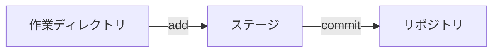

# Git(ギット)

## Gitとは?
分散型バージョン管理システム。
ソースコードの管理や、チームでの共同開発ができる。

### 利点
[はじめてのGit forデザイナー＆コーダー](https://www.slideshare.net/saekoyamamoto/gitfor)
  - Gitってなに？ プログラマではないけれど、Git導入するメリットは？ いわゆるデザイナーやコーダー向けの、「Gitとは？」「Gitの構造とは？」…のやさしい説明スライドです。

Gitを導入する利点がとてもよく分かる。5分くらいで気軽に読めるので、必読!!

### 概要
* Git を用いたバージョン管理のすすめ
https://www.jstage.jst.go.jp/article/isciesci/61/10/61_394/_pdf
  - 研究者向けに書かれたエッセイ。Gitのエッセンスを6ページに凝縮しており、概要を掴むのに最適。「3. Git によるバージョン管理」、「4. 複数人での Git」を読むと全貌が掴める。

### 基本的な流れ

1. ファイルやディレクトリの状態を記録するためのデータベースをつくる。これをリポジトリ（貯蔵所、倉庫、宝庫)といい、今までに開発してきた全ての歴史が保存されていく場所。
2. 作業ディレクトリ
  - ローカルコンピュータ(手元のコンピュータ)で、開発中のディレクトリのこと。
3. ステージ
  - どのファイルをリポジトリへ保存するのかを管理する領域。
  - (準備ができたものを、リポジトリに登録(公開)するイメージ)
4. ローカルリポジトリ
  - 手元のコンピュータのリポジトリ。今までの自分の開発した履歴が保存されている。
5. リモートリポジトリ
  - クラウド上にある共同開発用のリポジトリ。


<figcaption class="left" style="margin-bottom: 2rem;"> 図: Gitの三つの領域 </figcaption>


1.は一番最初に一度行う。  
2.で今まで通り開発を行い、区切りのいいところまで開発したら、  
3.のステージングエリア(準備領域)にファイルを登録して、  
4.のローカルリポジトリにコミット(保存)する。  
そして、2.に戻って、開発を続ける。  
5.のリモートリポジトリに、自分の開発履歴(ローカルリポジトリ)を公開する操作をpush(押し上げる)という。皆で共用したいものができたときにすると良い。  
(一人で開発しているときには、自分用のバックアップ(控え)になる。)
逆に、リモートリポジトリを、ローカルリポジトリに落とす操作をfetch(取ってくる)という。

### 操作環境

CUI: ターミナルからコマンドを入力して行う方法。基本。
GUI: グラフィカルに図示される。いろいろなソフトがあるが、[SourceTree](https://www.sourcetreeapp.com) がおすすめ。

### 参考書籍
* わかばちゃんと学ぶGit
  - 漫画や可愛いイラストが豊富で、分かりやすい。

* よくわかる入門Git
  - 本書は、Gitの基本的な使い方から、チーム開発で使うための機能「ブランチ」、そして高度なGitコマンドまでを解説した入門書です。さらにGitのブランチモデルである「Git flow」と「GitHub-flow」の二つも紹介。チーム開発の基本スキルが身につきます!

### 参考Webサイト
* [はじめてのGit forデザイナー＆コーダー](https://www.slideshare.net/saekoyamamoto/gitfor)
  - Gitってなに？ プログラマではないけれど、Git導入するメリットは？ いわゆるデザイナーやコーダー向けの、「Gitとは？」「Gitの構造とは？」…のやさしい説明スライドです。Gitを導入する利点がとてもよく分かる。5分くらいで気軽に読めるので、必読!!

* [Git を用いたバージョン管理のすすめ](https://www.jstage.jst.go.jp/article/isciesci/61/10/61_394/_pdf)
  - 研究者向けに書かれたエッセイ。Gitのエッセンスを6ページに凝縮しており、概要を掴むのに最適。「3. Git によるバージョン管理」、「4. 複数人での Git」を読むと全貌が掴める。

* [git - 簡単ガイド 猫でもわかるGit 最初の一歩](http://rogerdudler.github.io/git-guide/index.ja.html)
  - 一ページに纏めたGitの導入ページ。簡潔に纏まっています。

* [GIT チートシート](https://github.github.com/training-kit/downloads/ja/github-git-cheat-sheet.pdf)
  - Git を使えるようになったら見ておきたい。良く使うコマンドを2ページに纏めてある。

* [計算機科学実験及演習3 ハードウェア「Gitの使い方」](http://www.lab3.kuis.kyoto-u.ac.jp/~takase/le3a/2020HW3-git.pdf)
  - 京都大学情報学科計算機科学コース で学ぶ学生向けのGitの100枚(A4版なら25枚)のスライド。Git / GitHubについて、概要や使用例を紹介している。

* [Pro Git](https://git-scm.com/book/ja/v2)
  - 500ページにわたりGitを詳細に解説。
  - 二章だけでも読むとよい。80ページで、Gitの主な使い方が学べるチュートリアル形式になっており、手を動かしながら、基本的な使い方を習得できる。

* 引用Webサイト
* [Gitの基本操作逆引き辞典](https://qiita.com/ray_20500/items/490b4a49f6da20b616a7)
* [git switchとrestoreの役割と機能について](https://qiita.com/yukibear/items/4f88a5c0e4b1801ee952)

## 環境設定

### macOS用パッケージマネージャ Homebrew をインストールする。
``` sh
$ /bin/bash -c "$(curl -fsSL
  https://raw.githubusercontent.com/Homebrew/install/master/install.sh)"
```

### 高機能ターミナルソフト iTerm2 をインストールする。
``` sh
$ brew cask install iterm2
```

### Git をインストールする。
``` sh
$ brew install git
```

## Gitの初期設定

### バージョン確認
``` sh
$ git version
```

### コミット操作に付加する名前を設定する
``` sh
git config --global user.name  "Yamada Taro"
```

### コミット操作に付加するメールアドレスを設定する
``` sh
git config --global user.email "taro@example.com"
```

### コマンドラインの出力を色をつけ見やすくする。
``` sh
git config --global color.ui auto
```

### git commit で Atom を使うようにする。
``` sh
$ git config --global core.editor "atom --wait"
```

### git l でログを簡潔表示できるようにする。
``` sh
$ git config --global alias.l "log --date=short --pretty=format:'%C(yellow)%h %C(reset)%cd %C(red)%d %C(reset)%s'"
```

 ``` alias(別名) ``` と呼ばれる git の機能である。  

``` sh
$ git config --global -e
```
で、設定内容をエディタで編集できる。
いろいろな方が便利な設定を公開しているので、gitに慣れてきたら自分好みに使いやすくカスタマイズするのも良い。


### バージョン管理システムからの追跡を除外する。
``` .gitignore ``` ファイルに除外したいファイルやディレクトリのパターンを記述する。

<pre>
<code>
.DS_Store
build/
*.log</code>
</pre>

## 基本操作
### リポジトリの作成
ローカルリポジトリを新規作成する。  
``` sh
$ git init <プロジェクト名>
```

### 既存のリモートリポジトリをダウンロードする。
``` sh
$ git clone <url>
```


<figcaption class="left" style="margin-top: 0;"> 図: Gitの三つの領域 </figcaption>

### 新規または変更のあるファイルを表示する
``` sh
$ git status
```

### ファイルの変更内容を確認する
``` sh
$ git diff
```

### ファイルをステージに追加する。(Git の管理対象にする。)
``` sh
$ git add <ファイル名>
```

### 全てのファイルをステージに追加する。(Git の管理対象にする。)
``` sh
$ git add .
```

### Git の管理対象から、除外する。
誤ってステージングした際には、次のコマンドで取り消せる。
``` sh
$ git restore --staged <ファイル名>
```

### 変更をコミットする
エディタで、変更内容を編集して、コミットする。
``` sh
$ git commit
```

コマンドラインで、変更内容を入力して、コミットする。
``` sh
$ git commit -m "メッセージ"
```

### ステージングとコミットを一緒に行う
次のコマンドにより、纏めて行うことができる。
``` sh
$ git commit -am "メッセージ"
```

### コミットメッセージを修正する
コミットした後に、タイプミスなどに気付き、コミットメッセージを修正したいときは、次のコマンドを実行する。
``` sh
$ git commit --amend
```
エディタが立ち上がるので、メッセージを適宜編集し、``` Command + S```, ``` Command + W``` で、修正が完了する。

### 標準的な形式で、コミット履歴を確認する。
``` sh
$ git log
```

### 一行で簡潔に表示する。
``` sh
git log --date=short --pretty=format:'%C(yellow)%h %C(reset)%cd %C(red)%d %C(reset)%s'
```
毎回、入力すると大変なので、次のように ``` alias(別名) ``` を 定義すると良い。
``` sh
$ git config --global alias.l
"log --date=short --pretty=format:'%C(yellow)%h %C(reset)%cd %C(red)%d %C(reset)%s'"
```

次回以降、以下のコマンドで表示できる。
``` sh
$ git l
```

### ファイルの変更差分を表示する。
``` sh
git log -p <ファイル名>
```

### 二つのコミット間での相違を確認する
``` sh
git diff <コミットA> <コミットB> <ファイル名>
```

### 表示するコミット数を制限する
``` sh
git log -n<コミット数>
```

## ファイルの移動、削除の管理

## 作業ディレクトリからファイルを削除し、削除をステージする。
``` sh
$ git rm <ファイル名>
$ git rm -r <ディレクトリ名>
```
### バージョン管理からファイルを削除する。ローカルのファイルは保持する。
(パスワードファイルなどを間違えてコミットしてしまった場合に使うと良い。)

``` sh
$ git rm --cached <ファイル名>
```

### ファイル名を変更し、コミットする。
``` sh
$ git mv <旧ファイル名> <新ファイル名>
```

## ファイルの変更の取り消し
開発中、以前の状態に戻したいときにとても便利である。

### ローカルで編集後、まだコミットしていないファイルの変更を取り消す。
``` sh
$ git restore <ファイル名>
```

### コミットしたことのあるファイルを、特定のコミットの状態にする。
``` sh
$ git restore --source <コミット> <ファイル名>
```

## ブランチの操作


## リモートリポジトリとの同期

### リモートリポジトリ(GitHub)を新規登録する
``` sh
git remote add origin https:github.com/<利用者名>/<リポジトリ名>.git
```

``` origin ``` という名前でリモートリポジトリを登録する。
今後は ```origin``` という名前でgithubリポジトリにアップしたり取得したりできる。
(Gitではメインのリモートリポジトリの事を ```origin``` と呼んでいる。)

### リモートリポジトリに、ローカルリポジトリを送信する

``` sh
$ git push <リモート名> <ブランチ名>
$ git push origin master
```

毎回、``` git push origin master ``` と入力するのは手間なので、
``` sh
$ git push -u origin master
```
を行うと、次回以降、
``` sh
$ git push
```
で、リモートリポジトリに、ローカルリポジトリを送信できる。

### リモートリポジトリから履歴を取得、作業ディレクトリに取り込む(fetch & merge)
``` sh
# リモートリポジトリのマスターブランチをダウンロードする。
$ git fetch origin
# ブランチを切り替えてフェッチした内容を確認する
git switch remotes/origin/master

$ git
$ git switch master         # master ブランチに切り替える
```

これを、リモートリポジトリに統合(merge)するには、次のコマンドを実行する。

``` sh
$ git merge origin/master
```
これで、現在のブランチに、リモートリポジトリが統合される。

### リモートリポジトリから履歴を取得、作業ディレクトリに取り込む(pull)
``` sh
$ git pull
```
リモートリポジトリから履歴を取得、変更を統合する。
(リモートリポジトリの履歴に置き換わる)


**補足**

ブランチの中身を全て確認する（-aはallの略）
現在いるブランチに「＊」がつく
git branch -a

ブランチを切り替えてフェッチした内容を確認する
git checkout remotes/origin/master

元のマスターブランチに切り替える
git checkout master


git pullは下記コマンドと同じ事をしている
git fetch origin master
git merge origin/master

git pullはリモートリポジトリからローカルリポジトリのワークツリーに反映させるのを一度にやってしまう。便利な反面注意点がある。

プルを実行する際の注意点
プルしてきたブランチは現在いるブランチに統合される為、思わぬブランチに統合されファイルがぐちゃぐちゃになってしまう危険性がある。
そのため慣れないうちはフェッチを使った方が安全。

### ブランチ
並行して複数の機能を開発するためにあるのがブランチ

#### ブランチを新規作成する
```bash
$ git branch <ブランチ名>
$ git branch feature
```

#### ブランチの一覧を表示する
```bash
$ git branch
```

#### ブランチを切り替える
```bash
$ git switch <既存ブランチ名>
$ git switch feature
```

#### ブランチを新規作成して切り替える
```
git switch -c <新ブランチ名>
```

#### ブランチを変更・削除する
```bash
# 自分が作業しているブランチの名前を変更する
git branch -m <ブランチ名>
git branch -m new_branch
git branch -m <古いブランチ名> <新しいブランチ名>

# ブランチを削除する
# masterにマージされていない変更が残っている場合はエラーが出る
git branch -d <ブランチ名>
git branch -d feature

# ブランチを強制削除する
# masterにマージされていない変更が残っていても強制削除される
git branch -D <branch名>
```

### マージ
マージとは他の人の変更内容を取り込む作業のこと

#### Auto Merge:基本的なマージ
`masterブランチ` の内容が `developブランチ` を分岐した時より進んでしまっている場合、両方の変更を取り込んだマージコミットが作成される。
マージコミットは２つのperentをもつ。

```bash
# 指定したブランチが作業中のブランチにマージされる
git merge <ブランチ名>
git merge <リモート名/ブランチ名>
git merge origin/master
```

#### コンフリクト
`masterブランチ`と`developブランチ`で
同じファイルの同じ行が編集されていた場合、
マージした際に `コンフリクト` が起きる。

###### コンフリクトが起きないようにする為には
・複数人で同じファイルを変更しない
・pullやmergeをする際に変更中の状態をなくしておく（commitやstashをしておく）

## プルリクエスト
自分の変更したコードをリポジトリに取り込んでもらえるよう依頼する機能

```bash
# プルリクエストの順序

1. ブランチを切る
2. ファイルを編集する
3. ローカルにadd,commitする
4. githubにプッシュする
5. githubで「Pull request」タブの「New pull request」ボタンを選択。
6.「base」と「compare」を選択する。
7.「Create pull request」を選択。
8.タイトルとコメントを入力。
9.「Create pull request」を押す。
10.右側の「reviewers」からレビューしてもらいたい人を選択し通知を送る。

# レビュワーの作業順序

1. githubで「Pull request」タブのレビューするコードを選択。
2. 「File changed」からコードを確認する。
3. コードの修正依頼をする場合は修正するコードをホバーして「➕」を押す。
4. コメントを入力して「Add single comment」を押す
5. コードレビューがリクエストした人に送信される。


# プルリクエストした内容を承認する場合

1.githubで「Pull request」タブの「Review changes」を押す。
2.「Approve」を選択し「Submit review」を押す。


# 承認されたリクエストをマージする方法

1. githubで「Pull request」タブの中の「conversation」タブで「Merge pull request」を選択する。
2.マージメッセージを確認し「Comfirm merge」を押す。
3.「Delete branch」ボタンを押してプルリクエストブランチを削除する。


# マージした内容をローカルにも取り込みプリクエストブランチを削除する。

git checkout master
git pull origin master
git branch -d pull_request

```

#### プルにはマージ型とリベース型がある
```bash
# マージ型のプル（通常のプル fetch → mergeと同じ挙動）
git pull <リモート名> <ブランチ名>
git pull origin master

## タグ
コミットを参照しやすくするために、分かりやすく名前を付けるのがタグ。
よくリリースポイントに使います。

#### タグの一覧を表示する
```bash
git tag
```

#### 軽量版のタグの作成
```bash
git tag <タグ名>
git tag v1.0.0
```

#### 昔のコミットにタグを付ける
```bash
git tag <タグ名> <コミットID>
git tag v0.2.0 hfk9dsh
```

タグの情報を表示する
$ git show v1.0.0


#### タグをリモートリポジトリに送信する方法
```bash
git push <リモート名> <タグ名>
git push origin v1.0.0

# タグを一斉に送信する
git push origin --tags
```

#### タグを削除する
``` sh
$ git tag -d v1.0.0
```
``` sh
$ git push --delete origin v1.0.0
```


### ブランチを切り替える
```
$ git switch <branch>
```

# ブランチを新規作成して切り替える
```
$ git switch -c <branch>
```

Gitの基本操作逆引き辞典
https://qiita.com/ray_20500/items/490b4a49f6da20b616a7

[git switchとrestoreの役割と機能について](https://qiita.com/yukibear/items/4f88a5c0e4b1801ee952)
