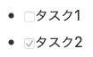

Markdown(マークダウン)とは
===============================================================================
Markdown（マークダウン）は、文書を記述するための軽量マークアップ言語のひとつである。
「書きやすくて読みやすいプレーンテキストとして記述した文書を、妥当なHTML文書へと変換できるフォーマット」として、ジョン・グルーバーやアーロン・スワーツにより作成された。
Markdownの記法の多くは、電子メールにおいてプレーンテキストを装飾する際の慣習から着想を得ている。
(Wikipediaより)

記法
-------------------------------------------------------------------------------

### 段落
段落は1つ以上の連続したテキストであり、空行によって分けられる。
通常の段落をスペースやタブでインデントしてはならない:

```
これは段落です。2つの文があります。

これは別の段落です。ここにも2つの文があります。
```


### 改行
テキストに挿入された改行は最終的な結果から取り除かれる。
強制的に改行したい場合は、行末に2つのスペースを挿入すればよい。

### テキストの装飾
```
*強調* 斜体<em>
```

*強調*

```
**強い強調** 太字<strong>
```

**強い強調**

```
~~打ち消し線~~ 打ち消し線<del>
```

~~打ち消し線~~


### 見出し
HTMLの見出しは、テキストの前にいくつかの'#'を置くことで作ることができる。

```
# レベル1の見出し (=h1)
```

# レベル1の見出し

```
###### レベル6の見出し (=h6)
```

###### レベル6の見出し

```h1``` と ```h2``` は、以下のようにも書ける。

```
レベル1の見出し (=h1)
===============
```

```
レベル2の見出し (=h2)
---------------
```


### 箇条書き(番号無)
``` - ``` 、 ``` * ``` どちらの記号も使えます。結果は同じになります。

```
- 順序無しリストアイテム
    - サブアイテムはタブもしくは4つのスペースでインデントする
- 順序無しリストの別のアイテム
```

```
* 順序無しリストのアイテム
    * サブアイテムはタブもしくは4つのスペースでインデントする
* 順序無しリストの別のアイテム
```

* 順序無しリストのアイテム
    * サブアイテムはタブもしくは4つのスペースでインデントする
* 順序無しリストの別のアイテム


### 箇条書き(番号付)
番号は自動で振られるので、全て ```1. 項目``` とすると良い。<br>

```
1. 順序付きリストのアイテム
  1. 順序付きリストのサブアイテム その一
  1. 順序付きリストのサブアイテム その弐
  1. 順序付きリストのサブアイテム その参
1. 順序付きリストの別のアイテム
  1. 順序付きリストのサブアイテム その一
  1. 順序付きリストのサブアイテム その弐
1. 順序付きリストの別のアイテム
1. 順序付きリストの別のアイテム
1. 順序付きリストの別のアイテム
```

1. 順序付きリストのアイテム
  1. 順序付きリストのサブアイテム その一
  1. 順序付きリストのサブアイテム その弐
  1. 順序付きリストのサブアイテム その参
1. 順序付きリストの別のアイテム
  1. 順序付きリストのサブアイテム その一
  1. 順序付きリストのサブアイテム その弐
1. 順序付きリストの別のアイテム
1. 順序付きリストの別のアイテム
1. 順序付きリストの別のアイテム


### 引用
```>``` を行頭に付けることで、引用文になります。

```
宮沢賢治 ポラーノの広場 より引用
> 　あのイーハトーヴォのすきとおった風、夏でも底に冷たさをもつ青いそら、うつくしい森で飾られたモリーオ市、郊外のぎらぎらひかる草の波
>
> 　またそのなかでいっしょになったたくさんのひとたち、ファゼーロとロザーロ、羊飼のミーロや、顔の赤いこどもたち、地主のテーモ、山猫博士のボーガント・デストゥパーゴなど、いまこの暗い巨きな石の建物のなかで考えていると、みんなむかし風のなつかしい青い幻燈のように思われます。では、わたくしはいつかの小さなみだしをつけながら、しずかにあの年のイーハトーヴォの五月から十月までを書きつけましょう。
```

宮沢賢治 ポラーノの広場 より引用
> 　あのイーハトーヴォのすきとおった風、夏でも底に冷たさをもつ青いそら、うつくしい森で飾られたモリーオ市、郊外のぎらぎらひかる草の波
>
> 　またそのなかでいっしょになったたくさんのひとたち、ファゼーロとロザーロ、羊飼のミーロや、顔の赤いこどもたち、地主のテーモ、山猫博士のボーガント・デストゥパーゴなど、いまこの暗い巨きな石の建物のなかで考えていると、みんなむかし風のなつかしい青い幻燈のように思われます。では、わたくしはいつかの小さなみだしをつけながら、しずかにあの年のイーハトーヴォの五月から十月までを書きつけましょう。


### 水平線
1行の中に、3つ以上のハイフンやアスタリスク・アンダースコアだけを並べると水平線が作られる。
ハイフンやアスタリスクのあいだには空白を入れてもよい。
以下の行はすべて水平線を生成する。

```
* * *
```

```
***
```

```
*****
```

```
- - -
```

```
---------------------------------------
```

---------------------------------------


### リンク
リンクは次のように記述できる。
```
[リンクのテキスト](リンクのURL)
```

[リンクのテキスト](リンクのURL)

```
<a href="リンクのURL">リンクのテキスト</a>
```
のようになります。


URLが長かったり、良く使うリンクには名前を付けることもできます。
```
[リンクテキスト][名前]
[名前]:URL
```


使うときには、
```
[リンクの名前][]
```
のように使います。


### ページ内リンク
[見出し](#見出し)


### 画像

```

```

```

```
のようになります。


### 表
```
| Left align | Center align | Right align |
|:-----------|:------------:|------------:|
| Apple      |    Apple     |       Apple |
| Banana     |    Banana    |      Banana |
| Cherry     |    Cherry    |      Cherry |
```

| Left align | Center align | Right align |
|:-----------|:------------:|------------:|
| Apple      |    Apple     |       Apple |
| Banana     |    Banana    |      Banana |
| Cherry     |    Cherry    |      Cherry |


### コード
コードを含める場合、3つずつのバッククオートでコード全体をくくる。
開始を表すバッククオートの3つ目に続けて、任意で言語名を明記することができる。

<pre>
```ruby
   puts "Hello world"
```
</pre>


### チェックボックス
```
- [ ] タスク1
- [x] タスク2
```

(対応していない場合もあります)




### 注釈
注釈を書くこともできます。
「インターネット・プロトコル・スイート」という技術用語に注釈を付けてみます。

```
インターネットとは、「インターネット・プロトコル・スイート」[^1]を使用し、
複数のコンピュータネットワークを相互接続した、地球規模の情報通信網のことである。

[^1]: TCP/IPプロトコル・スイート とも呼ばれる、標準化された通信規約のこと。
```

インターネットとは、「インターネット・プロトコル・スイート」[^1]を使用し、<br>
複数のコンピュータネットワークを相互接続した、地球規模の情報通信網のことである。<br>

[^1]: TCP/IPプロトコル・スイート とも呼ばれる、標準化された通信規約のこと。


### HTML
本文中に、一部のhtmlタグを記述することもできます。

```
<figcaption>図1 りんご</figcaption>
```
